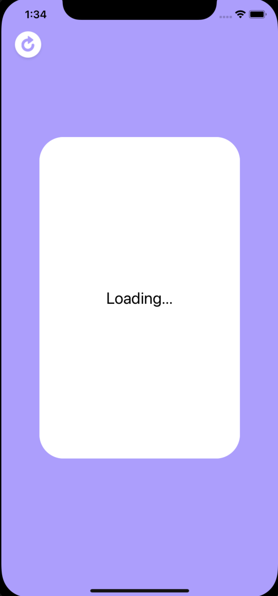

# Pokemon Card Animation

In this task, I have used https://pokeapi.co to get our data.

## Preview For Ipad

## Preview For Iphone 11

## Detail

 - This is simple Pokemon cards. 
 - Actually there are two views as front side and back side. Pressing the front side will activate the first animation and the back side will be visible. Finally pressing the visible card side will activate the second animation and thus the first side of the card will be visible.
 - Also there is a loading label. While API calling, the loading label becomes active and user interaction is inactive until the api call is finished.
 - Additionally, there is a reload button in the up left corner. When pressed the button, The Pokemon queue starts over.
 
 ## Loading Screen 
 
  
  
  ### Contact

Questions? Feel free to [email me](mailto:dogukaninci93@gmail.com) and I’ll answer ASAP.

